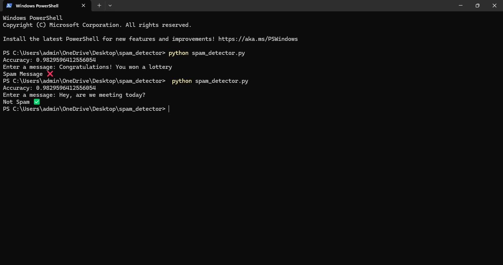

# Spam Message Detector

## Problem
Spam messages are common and can be misleading or harmful.

## Solution
This project uses Machine Learning to classify SMS messages as Spam or Not Spam.

## Technologies Used
- Python
- Pandas
- Scikit-learn

## How to Run
1. Clone the repository
2. Install dependencies:
   pip install -r requirements.txt
3. Run the program:
   python spam_detector.py

## Example
Input:
You won a free lottery!

Output:
Spam Message ❌# spam-detector

##interface

